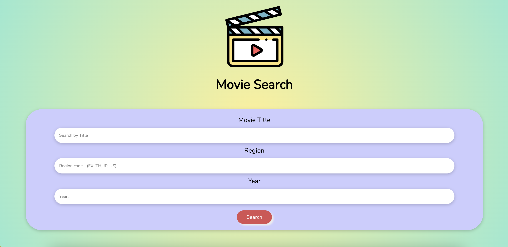
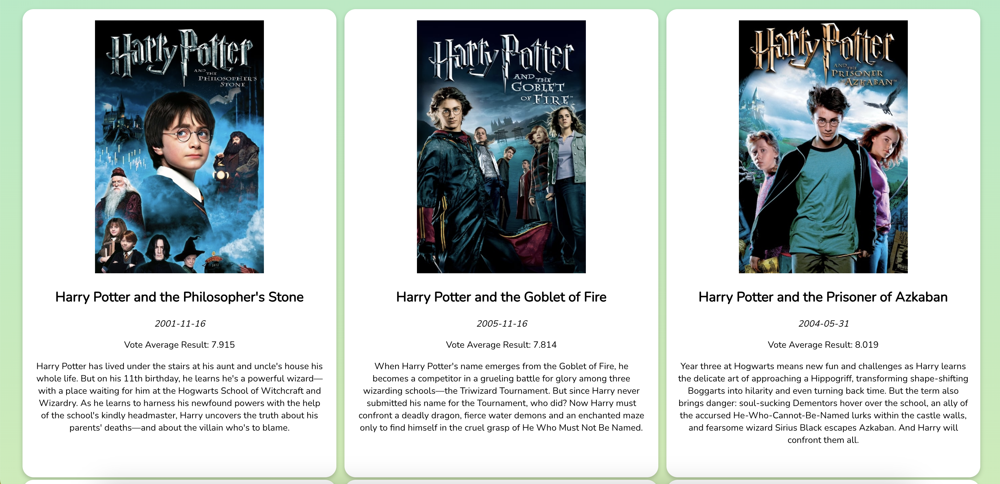

# Search Movies React
---
This project is an implementation of a web application using **React** and **[The Movie DB](https://developer.themoviedb.org/reference/intro/getting-started) API** to search movie information by movie name, movie region, and released year

### How to start the web application
1. Open the files in any code editor such as VS Code.
2. Type npm install and then npm start in the terminal.
3. The web browser http://localhost:3000/ should show the web application.
---
# Snapshot of the prototype

